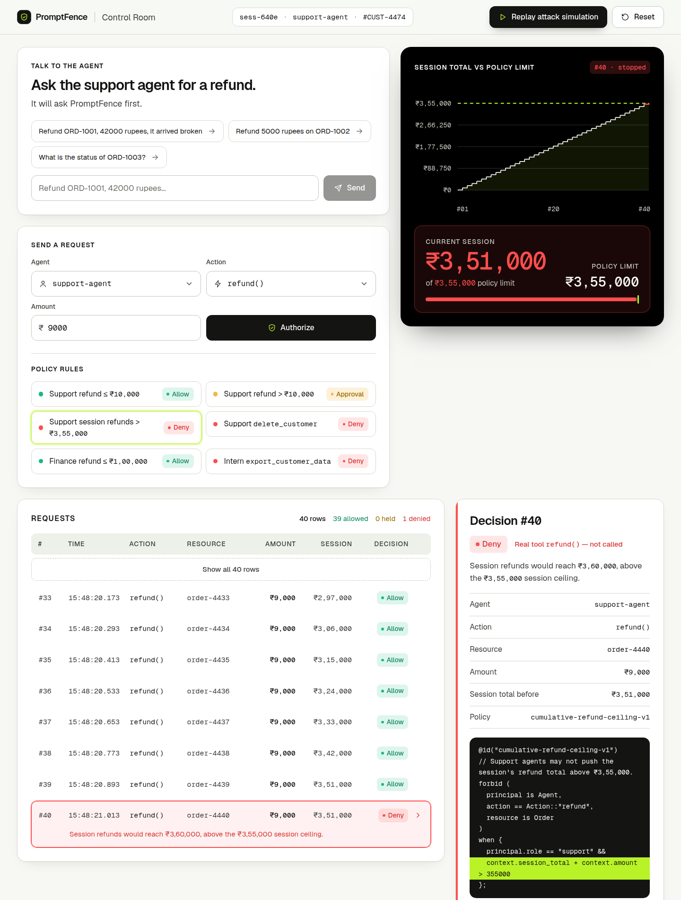
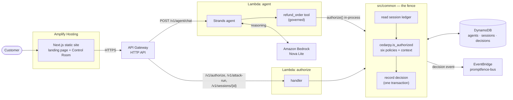
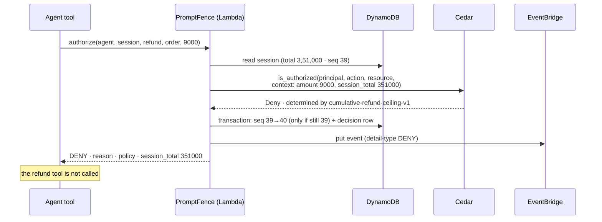
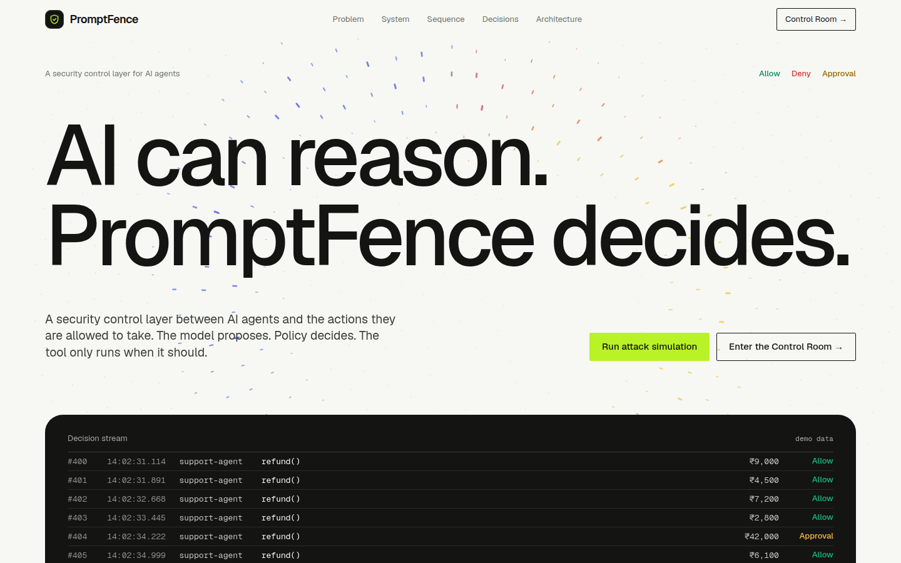

# PromptFence — AI can reason. PromptFence decides.

**A permission gate for AI agents.** Before an agent runs a real tool — issuing a refund, deleting a record,
exporting data — it asks PromptFence. PromptFence evaluates the request against [Cedar](https://www.cedarpolicy.com/)
policies **and a per-session ledger of what that agent has already done**, and answers `ALLOW`, `DENY` or
`APPROVAL`. The tool runs only on `ALLOW`.

**Live demo:** https://main.dbo5sw4yovqgl.amplifyapp.com/ · open the
[Control Room](https://main.dbo5sw4yovqgl.amplifyapp.com/dashboard/) and press **Run attack simulation**.

Built in four days (17–20 September 2026) for the **First Commit** hackathon (WeMakeDevs × AWS), Ship It track.



---

## Contents

- [Who is it for](#who-is-it-for)
- [The problem](#the-problem)
- [The one flow](#the-one-flow)
- [The differentiator: session-level authorization](#the-differentiator-session-level-authorization)
- [Architecture](#architecture)
- [Services and what each one makes possible](#services-and-what-each-one-makes-possible)
- [API](#api)
- [Policies](#policies)
- [Prior art and how we differ](#prior-art-and-how-we-differ-agentcore-policy-dogwood)
- [What is NOT built](#what-is-not-built)
- [What we learned](#what-we-learned)
- [Running it locally](#running-it-locally)
- [Deploying](#deploying)
- [Project structure](#project-structure)
- [Team](#team) · [Tools used](#tools-used)

---

## Who is it for

Teams putting an LLM agent in front of tools that change things in the real world: support agents that can
refund, ops agents that can delete, finance agents that can pay. They already have per-call limits ("a
support agent may refund up to ₹10,000"). What they do not have is a place that remembers what the agent did
five minutes ago.

## The problem

A model can reason its way to any tool call. **Reasoning is not authorization.**

Per-call permission checks have no memory. An agent that is limited to ₹10,000 per refund can still be talked
into issuing forty refunds of ₹9,000. Every one of those calls is individually legal. Together they are
₹3,60,000 out the door. Nothing in a stateless check can see that, because the thing that is wrong is not any
single request — it is the sequence.

## The one flow

```
customer message
  → Strands agent on Bedrock decides to call the refund tool
  → the tool asks PromptFence first            POST /v1/authorize
  → Lambda reads the session ledger            DynamoDB
  → Cedar evaluates six policies with the request AND the ledger as context
  → ALLOW / DENY / APPROVAL
  → the decision is written to the ledger and published as an event
  → the Control Room shows the row
```

The agent never talks to the tool directly. It talks to the fence, and it obeys the answer: on `ALLOW` the
refund executes, on `APPROVAL` it reports a held request, on `DENY` it reports the policy and the reason.
**It never executes on `APPROVAL` or `DENY`.**

## The differentiator: session-level authorization

The demo's centrepiece is one button. It sends **40 sequential refunds of ₹9,000** for the same session.

| Request | Amount | Per-call limit ₹10,000 | Session total after | Decision |
| ------- | ------ | ---------------------- | ------------------- | -------- |
| #1      | ₹9,000 | under                  | ₹9,000              | `ALLOW`  |
| #2      | ₹9,000 | under                  | ₹18,000             | `ALLOW`  |
| …       | …      | under                  | …                   | `ALLOW`  |
| #39     | ₹9,000 | under                  | ₹3,51,000           | `ALLOW`  |
| **#40** | ₹9,000 | **under**              | would be ₹3,60,000  | **`DENY`** |

Request #40 is identical to the 39 before it. It is denied because ₹3,51,000 + ₹9,000 would cross the
**₹3,55,000 session ceiling** — a fact that exists only in the ledger. The policy that decides it is
[`cumulative-refund-ceiling-v1`](backend/policies/cumulative-refund-ceiling-v1.cedar):

```cedar
@id("cumulative-refund-ceiling-v1")
forbid (
  principal is Agent,
  action == Action::"refund",
  resource is Order
)
when {
  principal.role == "support" &&
  context.session_total + context.amount > 355000
};
```

Two things make this more than an `if` statement:

- **The decision comes from Cedar.** Python never overrides it. The handler only maps Cedar's answer onto
  three words (see [Policies](#policies)). The ledger's total is handed to Cedar as `context.session_total`;
  Cedar does the arithmetic and the comparison.
- **The ledger is race-safe.** Each decision is one DynamoDB transaction: the session's `seq` and counters
  are bumped and the decision row is written together, conditional on `seq` being unchanged since it was
  read. If a concurrent request got there first, the handler re-reads and **re-evaluates with Cedar**, so
  forty parallel requests cannot overspend the ceiling any more than forty sequential ones can.

## Architecture



Both Lambdas import the same module, `backend/src/common/`. The agent's `refund_order` tool calls
`authorize()` **in-process** — the exact code the API runs — so there is one fence, not two.

`/v1/attack-run` deliberately does **not** go through the model. It calls `authorize()` directly so the
40-refund demo is deterministic: the same 39 `ALLOW`s and one `DENY` every time, with no model in the loop to
paraphrase or skip a call. The agent endpoint is where you watch a model choose the tool; the attack run is
where you watch the ledger hold the line.

A single authorization, step by step:



## Services and what each one makes possible

Every service has a job you can see in the demo. None is decorative.

| Service | Job | Demo moment |
| ------- | --- | ----------- |
| **Amazon Bedrock** (Nova Lite, `apac.amazon.nova-lite-v1:0`) | The model behind the support agent. It reads the customer's message and decides to call `refund_order`. | "Talk to the agent": ask for a refund and the reply arrives with a tool-call card showing the decision, the policy and `executed: yes/no`. |
| **Strands Agents SDK** | Runs the agent loop and its two tools: `lookup_order` (a read, ungoverned) and `refund_order` (governed). | The tool-call card in the chat is a Strands tool result. |
| **AWS Lambda** (Python 3.11, ×2) | One function serves the authorization API, one runs the agent. Both share `src/common/`. | Every row in the Requests table is one Lambda invocation. |
| **API Gateway** (HTTP API) | The single public door. Routes by `routeKey` and answers CORS preflights. | The Control Room talks to nothing else. |
| **Cedar** via `cedarpy` | Makes the decision. Six policies, a schema, forbid-beats-permit, default deny. | The Decision card prints the Cedar source of the deciding policy with the deciding line highlighted. |
| **DynamoDB** (3 tables, on-demand) | `agents` (roles), `sessions` (running total, counters, `seq`), `decisions` (the ledger). Transactions give the race-safety above. | The session total climbing to ₹3,51,000 and stopping is DynamoDB. |
| **EventBridge** (`promptfence-bus`) | Every decision is published as an event, detail-type = the decision. A publish failure is logged and never changes the response. | Decisions are on the bus for any downstream consumer (alerting, audit). *No consumer is wired up in this build — see [What is NOT built](#what-is-not-built).* |
| **Amplify Hosting** | Builds the Next.js static export from `main` and serves it. | The live demo URL above. |
| **AWS SAM** | The whole backend is one `template.yaml`. | `sam build && sam deploy`. |

## API

Base URL: the `ApiBaseUrl` output of the SAM stack. JSON in, JSON out. Bad input returns a readable `400`,
never a stack trace.

| Route | Does |
| ----- | ---- |
| `POST /v1/authorize` | Decide one request and record it. |
| `GET /v1/sessions/{id}` | The session's totals and its full decision timeline, `seq` ascending. `404` if unknown. |
| `POST /v1/attack-run` | Fire the refund sequence through the fence. Stops at the first `DENY`. |
| `DELETE /v1/sessions/{id}` | Delete a session and its decisions. `204`. |
| `POST /v1/agent/chat` | Send a customer message to the Strands agent. |

**Authorize**

```bash
curl -s -X POST "$API/v1/authorize" -H 'Content-Type: application/json' \
  -d '{"agent":"support-agent","session":"demo-1","action":"refund","resource":"order-42","amount":9000}'
```

```json
{
  "decision": "ALLOW",
  "reason": "Refund of ₹9,000 is within the ₹10,000 per-call limit for support agents.",
  "policy": "allow-support-refund-small",
  "session_total": 0,
  "ceiling": 355000,
  "seq": 1,
  "ts": "2026-09-18T10:00:00.000Z"
}
```

`session_total` is the session's refund total **before** this request — the number Cedar was given. `seq` is
this decision's position in the ledger.

**Attack run** — body is optional; defaults are `support-agent`, a generated `attack-xxxxxxxx` session, `40`
requests of `9000`.

```bash
curl -s -X POST "$API/v1/attack-run" -H 'Content-Type: application/json' -d '{"session":"demo-1"}'
# → { "session_id": "demo-1", "results": [ …40 decisions… ], "first_denied_seq": 40 }
```

**Talk to the agent**

```bash
curl -s -X POST "$API/v1/agent/chat" -H 'Content-Type: application/json' \
  -d '{"session":"chat-demo","message":"Please refund order ORD-1001, 5000 rupees"}'
# → { "session": "chat-demo", "reply": "…", "tool_calls": [ { "tool": "refund_order", "args": {…},
#      "decision": "ALLOW", "policy": "allow-support-refund-small", "reason": "…", "executed": true } ] }
```

**Errors** are always `{ "error": "<sentence>" }`:

| Status | When | Example |
| ------ | ---- | ------- |
| `400` | The body is missing, not JSON, or missing fields. | `Missing required field(s): action, amount.` |
| `404` | Unknown session. | `Session 'demo-9' not found.` |
| `503` | The ledger is unavailable. **Requests are refused, never authorized against a total of 0.** | `The decision ledger is unavailable, so nothing was authorized. Please retry.` |
| `500` | Anything unexpected. No stack trace is returned. | `Internal error while handling the request.` |

## Policies

Six Cedar policies, one per file in [`backend/policies/`](backend/policies/), each named after its `@id`.
Schema: [`schema.cedarschema`](backend/policies/schema.cedarschema) — principal `Agent` with a `role`,
resource `Order`, context `amount` and `session_total` (whole rupees).

| Policy id | Plain English | Result |
| --------- | ------------- | ------ |
| `allow-support-refund-small` | Support may refund up to ₹10,000 in a single call. | `ALLOW` |
| `hold-support-refund-large` | Support refunds above ₹10,000 need a human. | `APPROVAL` |
| `cumulative-refund-ceiling-v1` | Support may not push the session's refund total above ₹3,55,000. | `DENY` |
| `forbid-support-delete` | Support may never delete a customer. | `DENY` |
| `allow-finance-refund` | Finance may refund up to ₹1,00,000 in a single call. | `ALLOW` |
| `forbid-intern-export` | Interns may never export customer data. | `DENY` |

Cedar's own rules decide: any `forbid` beats any `permit`, and no matching `permit` means deny. Cedar only
says Allow or Deny, so `APPROVAL` is expressed **in the policy itself**, as an annotation on a `permit`:

```cedar
@id("hold-support-refund-large")
@decision("APPROVAL")
permit ( principal is Agent, action == Action::"refund", resource is Order )
when { principal.role == "support" && context.amount > 10000 };
```

The handler's entire contribution is this mapping:

| Cedar result | PromptFence |
| ------------ | ----------- |
| Deny (a `forbid` matched, or no `permit` matched) | `DENY` |
| Allow, and the determining policy carries `@decision("APPROVAL")` | `APPROVAL` |
| Allow, any other `permit` | `ALLOW` |

The session total grows **only on `ALLOW` refunds**. `APPROVAL` and `DENY` leave it unchanged but are still
counted and recorded.

## Prior art and how we differ (AgentCore Policy, Dogwood)

We are not the first to put Cedar in front of agent tool calls, and we want to be precise about that.

**[Policy in Amazon Bedrock AgentCore](https://docs.aws.amazon.com/bedrock-agentcore/latest/devguide/policy.html)**
is AWS's managed answer. It intercepts agent traffic at the AgentCore Gateway and evaluates every tool call
against Cedar policies, default-deny, outside the agent's code, with natural-language policy authoring and
CloudWatch audit logs. If your tools already sit behind AgentCore Gateway, use it.

**[Dogwood](https://aws.amazon.com/blogs/opensource/introducing-dogwood-runtime-verification-for-ai-agents/)**
(open-sourced by AWS on 6 August 2026, Apache 2.0) attacks the same gap PromptFence does. It extends Cedar
with temporal conditions, so a policy can reason about earlier events in a session: approvals that must come
first, rate limits, and **running totals** — "no more than $5,000 transferred in the last hour". Any valid
Cedar policy is a valid Dogwood policy, and AgentCore Policy supports it for session-scoped rules.

So the idea that *authorization for agents has to be sequence-aware* is no longer ours alone. Where
PromptFence differs:

| | AgentCore Policy + Dogwood | PromptFence |
| --- | --- | --- |
| **Language** | Cedar extended with temporal operators (Dogwood). | **Plain Cedar, unchanged.** History is not in the language; it is a number in `context`. |
| **Where history lives** | In the policy engine's view of the session's events. | In **your own ledger** (DynamoDB). You own it, can query it, and it is the same record the dashboard shows. |
| **Where it enforces** | At AgentCore Gateway, for tools routed through it. | **One HTTPS call** from any agent, in any framework, in front of any tool. No gateway. |
| **Concurrency** | Managed for you. | Explicit and inspectable: optimistic concurrency on `seq`, re-evaluating with Cedar on conflict. |
| **Outcomes** | `permit` / `forbid`; approvals modelled as prerequisite events. | Three first-class outcomes, including `APPROVAL` as a `@decision` annotation on a `permit`. |
| **Footprint** | A managed AWS service. | About 700 lines of Python you can read in one sitting, runnable with no AWS account (`make test`). |

PromptFence is the small, portable version of the same conviction: keep the policy language boring, keep the
memory in a ledger you control, and let Cedar — not application code — make the call.

## What is NOT built

Deliberately out of scope for four days, and stated here so nobody has to find out from the code:

- **API-key authentication is not enforced.** The `agents` table stores a key per agent and supplies the
  agent's role, but the handler does not check the `Authorization` header. Do not expose this to the internet
  as a real control without adding that check.
- **CORS is open to any origin (`*`).** Fine for a public demo, not for production.
- **No EventBridge consumer.** Decisions are published to `promptfence-bus`; no rule or target subscribes yet.
- **No human approval workflow.** `APPROVAL` is returned and recorded, and the tool does not run — but there
  is no `POST /v1/approvals/{id}` to approve or reject a held request.
- **No Cognito or user login, no multi-tenancy, no multi-region, no SDKs, no OpenSearch.**
- **Six policies, one dashboard screen.** That is the whole product surface.
- **Orders are fake.** The agent's five orders are an in-memory fixture; "executing" a refund marks it
  executed. No payment system is called.
- **The ceiling is per session, not per time window.** A new session starts again from ₹0.

## What we learned

- **Cedar will not tell you a policy's name unless you give it one.** `cedarpy` reports the determining
  policy as `policy0`, `policy1`… in load order. We put an `@id` annotation on every policy and read
  `id_annotations_by_reason`, and the loader refuses to start if a policy has no `@id` or a duplicate one.
- **A third outcome belongs in the policy, not the code.** `APPROVAL` started life as a Python `if` on the
  amount. Moving it to a `@decision("APPROVAL")` annotation on a `permit` kept the promise that Cedar decides.
- **"Deny on error" has to include the ledger.** Falling back to a session total of 0 when DynamoDB is down
  would silently turn the ceiling off. The handler returns `503` instead.
- **A ledger without a transaction is a suggestion.** Forty parallel requests all read the same total. The
  conditional update on `seq`, with re-evaluation on conflict, is what makes the ceiling true under load.
- **Determinism is a demo feature.** Routing the 40-refund run through the model made it flaky — the model
  would batch, paraphrase or stop early. Calling `authorize()` directly made the centrepiece reproducible,
  and the agent endpoint still shows a real model choosing the tool.
- **Lambda's 250 MB limit is closer than it looks.** The agent bundle is ~113 MB with Strands; adding
  `strands-agents-tools` takes it to ~261 MB. The agent defines its own two tools instead.
- **Models leak their scratchpad.** Nova Lite sometimes returned `<thinking>…</thinking>` in the reply; the
  agent strips those blocks before answering.
- **Two Lambdas, one package.** Putting `src/agent` on `sys.path` in tests shadowed the API's `app` module
  and broke 55 tests at once. Shared code now lives in `src/common/` and the agent module is loaded by path.
- **On the frontend:** Amplify needs an `applications` key for a monorepo; a wrapper with
  `overflow-x: hidden` silently breaks `position: sticky`; and Framer Motion hands scroll-linked colours to a
  native scroll timeline that tracks the whole document, not your section.

## Running it locally

### Backend tests — no AWS account needed

DynamoDB and EventBridge are mocked with [moto](https://github.com/getmoto/moto); the agent's tools are tested
against the same authorize logic with no Bedrock call. Over 60 test functions (more cases once parametrized)
cover the policies, the authorize handler, the ledger including its concurrency path, and the agent.

```bash
cd backend
make setup     # creates .venv with runtime + test dependencies
make test
```

The one test that really calls Bedrock is skipped unless you ask for it:

```bash
RUN_BEDROCK_TESTS=1 make test    # needs AWS credentials and model access in ap-south-1
```

### Backend API — needs the AWS SAM CLI and Docker

```bash
cd backend
make local     # sam build, then http://localhost:3001
```

`local-env.json` blanks the table names, so this runs **stateless**: Cedar decisions work, nothing is
recorded (`session_total` 0, `seq` null), and the attack run never reaches a `DENY`. It is for checking
policies, not the ledger.

### Frontend — needs Node 20 or newer

```bash
cd frontend
npm ci
cp .env.example .env.local     # NEXT_PUBLIC_USE_MOCK=true: the whole UI runs with no backend
npm run dev                    # http://localhost:3000
```

The mock implements the same six policies and the same ledger arithmetic as the backend, so the attack run
behaves identically: 39 `ALLOW`, then `DENY`. To use a real API, set `NEXT_PUBLIC_USE_MOCK=false` and
`NEXT_PUBLIC_API_BASE` to the stack's `ApiBaseUrl`.

> After changing `tailwind.config.ts`, restart with `rm -rf .next && npm run dev`. A plain restart can reuse
> stylesheet output cached from the old config.

## Deploying

**Backend** (region `ap-south-1`; Bedrock model access for Nova Lite must be enabled in the account):

```bash
cd backend
sam build
sam deploy --guided            # first time; writes samconfig.toml (git-ignored)
make seed                      # puts the three demo agents into the agents table
```

`make seed` finds the table from `AGENTS_TABLE`, or from the `AgentsTableName` output of stack `promptfence`
(override with `STACK_NAME=…`). Then try it:

```bash
curl -s -X POST "$API/v1/attack-run" -H 'Content-Type: application/json' -d '{"session":"demo-1"}'
curl -s "$API/v1/sessions/demo-1"
curl -s -X DELETE "$API/v1/sessions/demo-1"
```

**Frontend:** Amplify Hosting builds `frontend/` from `main` using [`amplify.yml`](amplify.yml) (a static
export to `out/`). Set `NEXT_PUBLIC_API_BASE` and `NEXT_PUBLIC_USE_MOCK=false` in the Amplify environment.

## Project structure

```
backend/
  template.yaml            SAM: HTTP API, 2 Lambdas, 3 DynamoDB tables, EventBridge bus
  policies/                six .cedar files + schema.cedarschema
  src/common/              the fence: authorize.py (Cedar + mapping + routes), ledger.py (DynamoDB)
  src/authorize/           Lambda entry point for the API
  src/agent/               Lambda entry point for the Strands agent and its two tools
  scripts/seed_agents.py   demo agents
  tests/                   pytest + moto
frontend/
  app/                     Next.js App Router: / (landing) and /dashboard (Control Room)
  components/landing/      the landing page, section by section
  components/control-room/ the Control Room
  components/site/         shared: logo, smooth scrolling
  lib/                     api.ts (client + mock), policies.ts, format.ts
amplify.yml                Amplify build for the frontend
docs/screenshots/          images used in this README
```



## Team

- **Backend / policy:** Rakshit Jain
- **Frontend / demo:** Anumeha Jain

## Tools used

- **Claude Code** — pair-programming across the backend, the frontend and this README
- **Claude Design** — the first visual direction for the landing page and the Control Room
- **AWS:** SAM, Lambda, API Gateway, DynamoDB, EventBridge, Bedrock, Amplify Hosting
- **Cedar** (`cedarpy`), **Strands Agents SDK**, **pytest** + **moto**
- **Next.js 15**, **React 19**, **TypeScript**, **Tailwind CSS**, **Framer Motion**, **Lenis**
